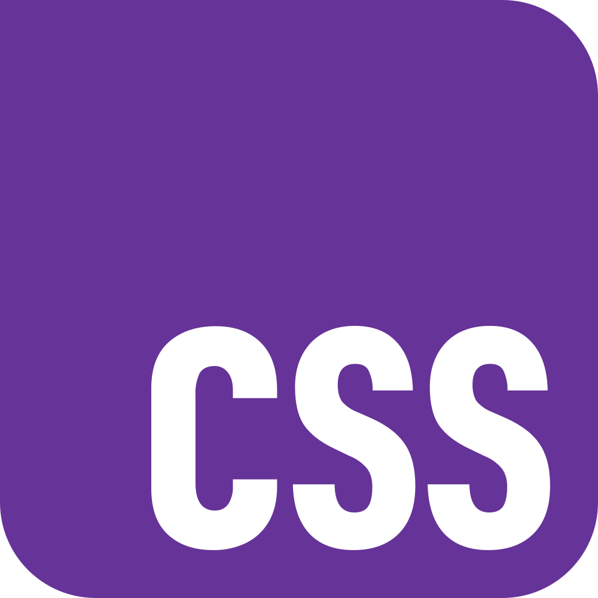
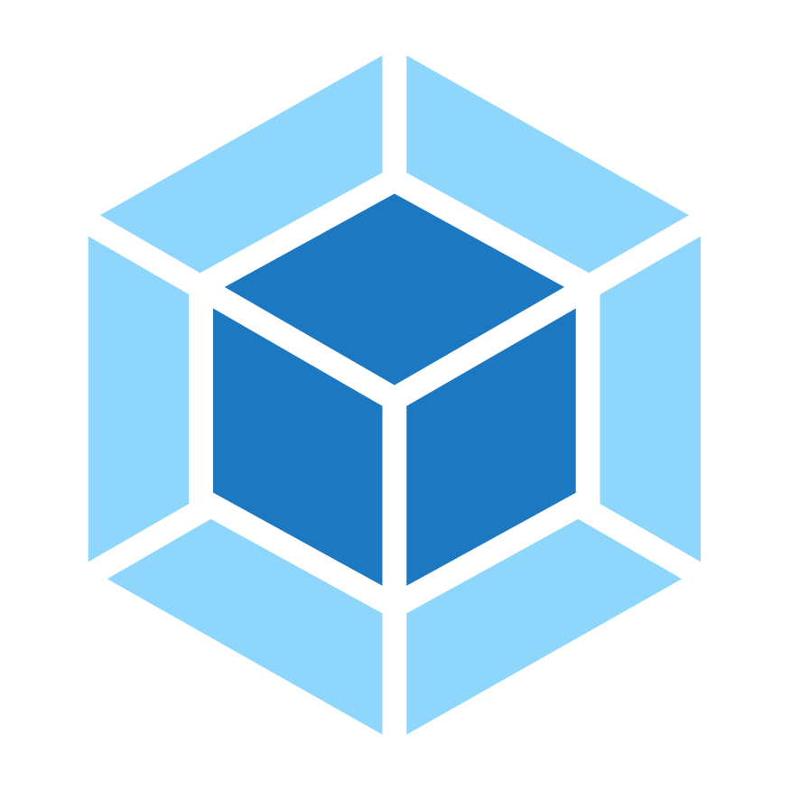
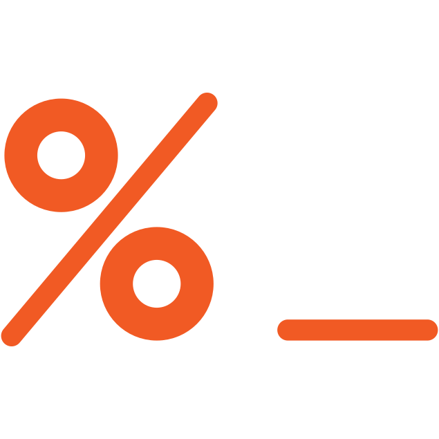
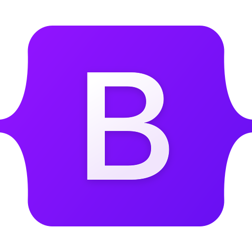

<!-- ###  -->

<h1 align="center">Daniel Freire</h1>
<h3 align="center">A passionate frontend developer</h3>

- 🔭 Working as **Frontend Developer**<!-- - 🌱 Learning **System Design** -->
- 👯 I’m looking to collaborate on **FOSS projects**
- 👨‍💻 My favorite projects are available at [daniel-freire.com/](https://daniel-freire.com/?utm_source=github)
- 📫 Best to reach me @ [daniel-freire.com/](https://daniel-freire.com/?utm_source=github)
- 😄 Pronouns: He/Him

<h2 align="center">✨ Projects</h2>
<table>
 <tr>
  <td colspan="2">
   <a href="https://quizzicall-bydainelli.netlify.app" target="_blank" rel="noreferrer"><h3 align="center">Quizzical</h3></a>
  </td>
  <td colspan="2">
   <a href="https://pollyglot-bydainelli.netlify.app" target="_blank" rel="noreferrer"><h3 align="center">PollyGlot</h3></a>
  </td>
 </tr>
 <tr>
  <td colspan="2">
   
  </td>
  <td colspan="2">
   
  </td>
 </tr>
 <tr>
  <td align="center">
   <a href="https://quizzicall-bydainelli.netlify.app/?utm_source=github" target="_blank" rel="noreferrer">
    
    
Website

   </a>
  </td>
  <td align="center">
    <a href="https://github.com/danielfreire-dev/Quizzical/tree/webpage" target="_blank" rel="noreferrer">
     
     
Repository

    </a>
  </td>
  <td align="center">
   <a href="https://pollyglot-bydainelli.netlify.app/?utm_source=github" target="_blank" rel="noreferrer">
    
    
Website

   </a>
  <td align="center">
   <a href="https://github.com/danielfreire-dev/PollyGlot/tree/gemini-code" target="_blank" rel="noreferrer">
    
    
Repository

   </a>
  </td>
 </tr>
 <tr>
  <td colspan="2">
   <h3>Summary: </h3>
   
Quizzical is a Trivia game that uses the Trivia Data Base for questioning the player's trivia knowledge.

  </td>
  <td colspan="2">
   <h3>Summary: </h3>
   
Pollyglot is a translation app using AI for more flexible and accurate translations.

  </td>
 </tr>
</table>

<h2 align="left">🛠️ Tech Stack:</h2>
 

   
   
   
   
   
   
   
   
   
   
   
   
   

    <kbd>
      <kbd>Languages</kbd>
       
       
      
      
      
      
      
    </kbd>

    <kbd>
      <kbd>Front End</kbd>
       
       
      
      
      
      
      
    </kbd>

    <kbd>
      <kbd>Back End</kbd>
       
       
      
      
      
    </kbd>

    <kbd>
      <kbd>Databases</kbd>
       
       
      
    </kbd>

    <kbd>
      <kbd>Testing</kbd>
       
       
      
      
      
    </kbd>

    <kbd>
      <kbd>Tools & DevOps</kbd>
       
       
      
      
      
    </kbd>

    <kbd>
      <kbd>Data Formats</kbd>
       
       
      
      
    </kbd>

  

   <!---->
   <!---->
   <!-- <a href="https://www.mysql.com/" target="_blank" rel="noreferrer">  -->
   <!-- <a href="https://postman.com" target="_blank" rel="noreferrer">  -->
  <!-- 
			
		

    	-->
     

<!--
**Dainelli/Dainelli** is a ✨ _special_ ✨ repository because its `README.md` (this file) appears on your GitHub profile.

Here are some ideas to get you started:

- 🔭 I’m currently working on ...
- 🌱 I’m currently learning ...
- 👯 I’m looking to collaborate on ...
- 🤔 I’m looking for help with ...
- 💬 Ask me about ...
- 📫 How to reach me: ...
- 😄 Pronouns: ...
- ⚡ Fun fact: ...
-->
