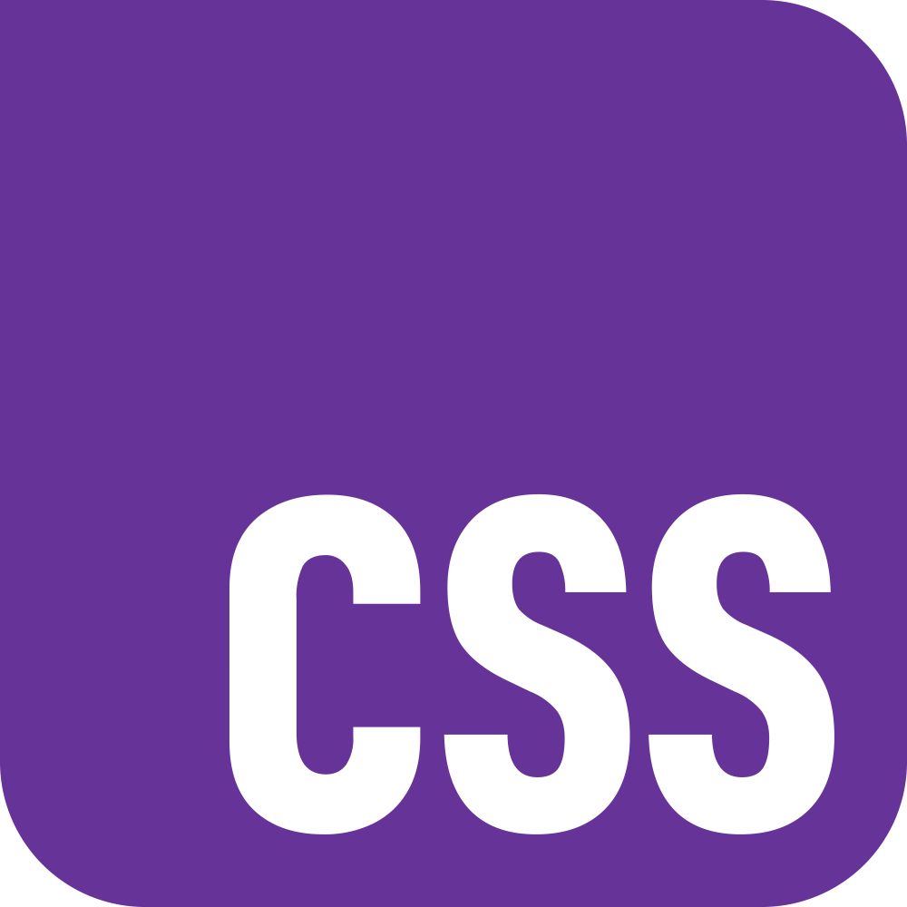

<!-- ###  -->

<h1 align="center">Daniel Freire</h1>
<h3 align="center">A passionate frontend developer</h3>

- 🔭 Working as **Frontend Developer**
- 🌱 Learning **Backend Development**
- 👯 I’m looking to collaborate on **FOSS projects**
- 👨‍💻 My favorite projects are available at [danielfreire.pages.dev/](http://danielfreire.pages.dev/)
- 📫 Best to reach me @ **daniel.freire@gmx.com**
- 😄 Pronouns: He/Him

<h2 align="center">Projects</h2>
<table>
	<tr>
		<td colspan="2">
			<a href="https://quizzicall-bydainelli.netlify.app" target="_blank" rel="noreferrer"><h3 align="center">Quizzical</h3></a>
		</td>
		<td colspan="2">
			<a href="https://pollyglot-bydainelli.netlify.app" target="_blank" rel="noreferrer"><h3 align="center">PollyGlot</h3></a>
		</td>
	</tr>
	<tr>
		<td>
			
		</td>
		<td>
			
		</td>
	</tr>
	<tr>
		<td align="center">
				<a href="https://quizzicall-bydainelli.netlify.app" target="_blank" rel="noreferrer">
					
					
Website

				</a>
		</td>
		<td align="center">
				<a href="https://github.com/danielfreire-dev/Quizzical/tree/webpage" target="_blank" rel="noreferrer">
					
					
Repository

				</a>
		</td>
		<td align="center">
			<a href="https://pollyglot-bydainelli.netlify.app" target="_blank" rel="noreferrer">
				
				
Website

			</a>
		<td align="center">
			<a href="https://github.com/danielfreire-dev/PollyGlot/tree/gemini-code" target="_blank" rel="noreferrer">
				
				
Repository

			</a>
		</td>
	</tr>
</table>

<h2 align="left">Languages and Tools:</h2>
	

			
			
			
			
			
			
			
			
			
			
			
			
			
			
			<!-- <a href="https://www.mysql.com/" target="_blank" rel="noreferrer">  -->
			<!-- <a href="https://postman.com" target="_blank" rel="noreferrer">  -->
		<!-- 
			
		

    	-->
    	

<!--
**Dainelli/Dainelli** is a ✨ _special_ ✨ repository because its `README.md` (this file) appears on your GitHub profile.

Here are some ideas to get you started:

- 🔭 I’m currently working on ...
- 🌱 I’m currently learning ...
- 👯 I’m looking to collaborate on ...
- 🤔 I’m looking for help with ...
- 💬 Ask me about ...
- 📫 How to reach me: ...
- 😄 Pronouns: ...
- ⚡ Fun fact: ...
-->
